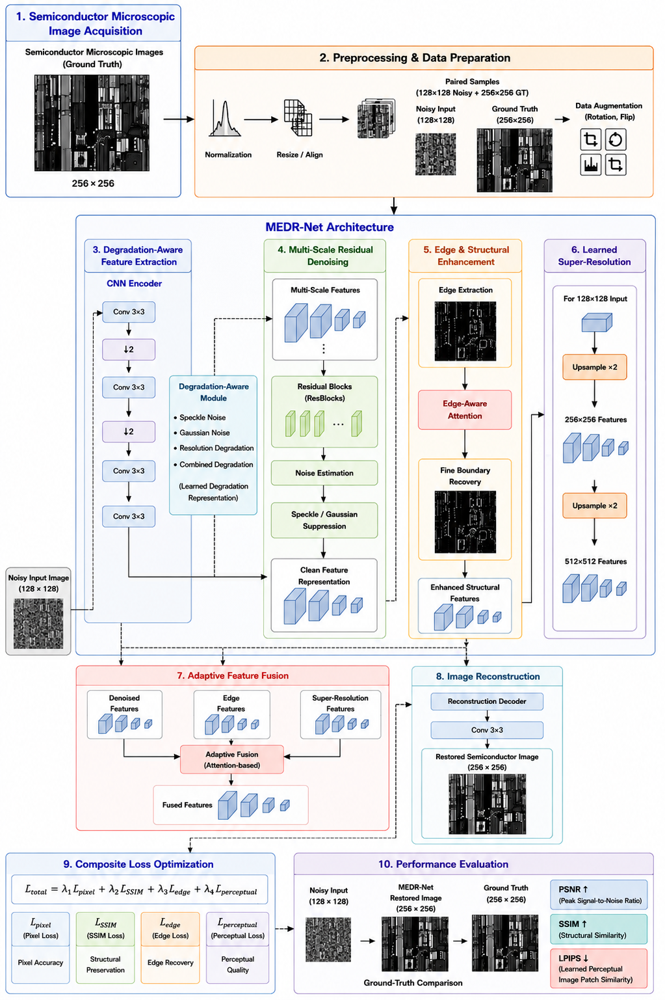
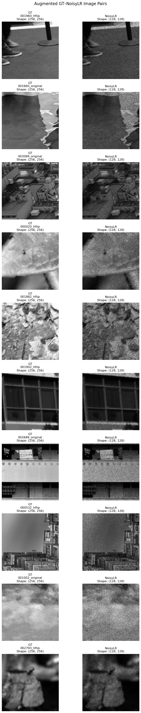
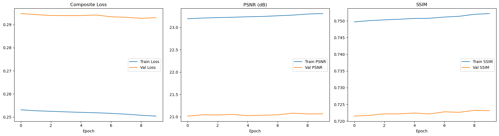
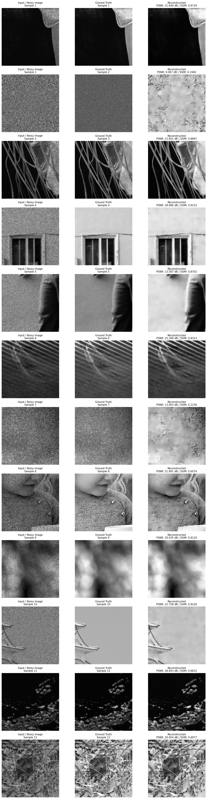
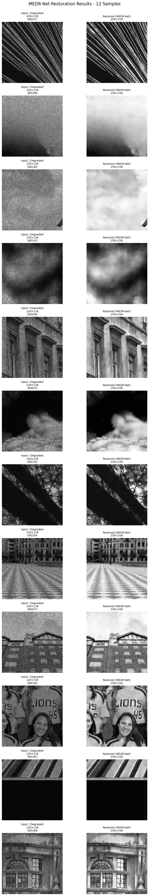

# MEDR-Net

**AI-Enhanced Multi-Degradation Restoration Network for Semiconductor Microscopic Image Restoration**

Built for the **KLA Problem Statement — SEMICON India Hackathon 2026**. MEDR-Net is a TensorFlow/Keras deep learning pipeline that restores `128×128×1` semiconductor microscopy images degraded by speckle noise, additive Gaussian noise and downsampling into clean `256×256×1` outputs — denoising, sharpening and 2x super-resolving in a single forward pass.

Semiconductor microscopy images are frequently degraded by sensor noise, low resolution, and blur introduced during acquisition. Restoring them accurately matters because downstream tasks — defect detection, measurement, classification — depend on structural detail (edges, boundaries, fine features) that naive denoising tends to destroy. MEDR-Net's architecture is built around preserving that structural detail while still removing noise, rather than treating restoration as one generic image-to-image translation problem.

## Contents

- [Architecture](#architecture)
- [What makes this approach distinctive](#what-makes-this-approach-distinctive)
- [Pipeline stages](#pipeline-stages)
- [Composite loss function](#composite-loss-function)
- [Evaluation metrics](#evaluation-metrics)
- [Results](#results)
- [Requirements](#requirements)
- [Data layout](#data-layout)
- [Usage](#usage)
- [Repository structure](#repository-structure)
- [External resources disclosure](#external-resources-disclosure)

## Architecture

MEDR-Net maps a `128×128×1` low-resolution, noisy input to a `256×256×1` restored output through five stages:

**DAFE → MSRL (×6 blocks) → EASE → LSRR (×3 branches) → AFF → Refinement → Output**



*End-to-end flow: raw microscopic image acquisition → preprocessing & augmentation → the five MEDR-Net stages (degradation-aware extraction, multi-scale denoising, edge enhancement, learned super-resolution, adaptive fusion) → composite-loss training → PSNR/SSIM/LPIPS evaluation.*

### 1. DAFE — Degradation-Aware Feature Extraction

Extracts initial features while adapting the response per channel to the type and severity of degradation in the specific input, instead of applying a fixed filter response to every image identically.

- A 3×3 convolution + LeakyReLU (α=0.2) extracts initial local features.
- A squeeze-and-excitation gate summarizes each feature channel via global average pooling, passes it through a two-layer bottleneck (reduction ratio 4), and produces a per-channel weight in `[0,1]` via sigmoid.
- Features are rescaled by that gate, then passed through a second 3×3 convolution + LeakyReLU.

### 2. MSRL — Multi-Scale Residual Learning (6 stacked blocks)

Denoises feature maps while preserving both fine texture and coarse structure, by examining each location's neighborhood at multiple receptive-field sizes simultaneously.

- Three parallel 3×3 convolutions with dilation rates **1, 2, 4** run on the same input — different effective receptive fields, no change in parameter count or spatial resolution.
- The three branches are concatenated, fused with a 1×1 convolution + LeakyReLU.
- A residual (skip) connection adds the block's input back, so each block only learns a correction.

### 3. EASE — Edge-Aware Structural Enhancement

Explicitly reinforces structural boundaries that a generic denoiser tends to blur away, since per-pixel losses alone favor smooth, low-detail solutions.

- A Sobel gradient-magnitude map is computed on the incoming feature maps.
- The edge map passes through a 3×3 convolution + LeakyReLU, then a 1×1 convolution + sigmoid converts it into a `[0,1]` spatial attention mask.
- The original input is multiplied by this mask and added back to itself (residual attention gate) — structural regions are selectively boosted, everything else passes through largely unchanged.

### 4. LSRR — Learned Super-Resolution / Reconstruction (applied to all 3 branches)

Upsamples 128×128 → 256×256 (2x) using a learned operator instead of fixed interpolation, since interpolation can only smooth existing values and cannot synthesize new detail.

- A 3×3 convolution expands channels by scale² (=4), preparing four channel-groups per output 2×2 pixel block.
- Pixel-shuffle (depth-to-space) rearranges the expanded channels into new spatial positions, doubling H/W and quartering channels.
- A final 3×3 convolution + LeakyReLU refines the new pixels and reduces checkerboard artifacts.

### 5. AFF — Adaptive Feature Fusion

Combines the three upsampled branches — denoised, structural, edge — using per-pixel learned weights, since the ideal blend of smooth-vs-sharp content varies by location (flat regions favor the denoised branch; boundaries favor the edge/structural branches).

```
[w1, w2, w3] = Softmax( Conv1x1( Concat(F_denoised, F_structural, F_edge) ) )
F_fused      = w1·F_denoised + w2·F_structural + w3·F_edge
Y            = LeakyReLU( Conv3x3(F_fused) )
```

Because `w1, w2, w3` are computed per pixel from the branch content itself, the network learns to rely on different branches at different spatial locations automatically — no manual rule for when to prefer sharpness over smoothness.

### Output head

Two refinement convolutions progressively reduce channel depth (filters → filters/2), followed by a final 3×3 convolution with sigmoid activation mapping to the single-channel output, constrained to `[0,1]` to match the normalized ground truth.

```
Ŷ = σ( Conv3x3( LeakyReLU( Conv3x3( LeakyReLU( Conv3x3(F_fused) ) ) ) ) )
```

## What makes this approach distinctive

- Splits restoration into three explicit, purpose-built branches — denoised content, structural/edge content, high-frequency detail — instead of one monolithic decoder for everything.
- Feature extraction is degradation-aware: a squeeze-and-excitation gate lets the network emphasize different filters per input, rather than applying the same fixed processing to every image.
- Multi-scale context comes from **parallel dilated convolutions**, not pooling/downsampling — the low-resolution input's spatial detail is never discarded before upsampling.
- Super-resolution uses **learned pixel-shuffle** upsampling (sub-pixel convolution) instead of fixed interpolation, so new pixels are synthesized by learned weights rather than smoothed from neighbors.
- The three branches are recombined via **per-pixel, softmax-weighted adaptive fusion** — the smooth-vs-sharp blend is decided locally, not globally.
- Training uses a **four-term composite loss** (pixel, SSIM, edge, perceptual), reflecting multiple notions of image quality at once instead of one narrow objective that could favor blurry output.

## Pipeline stages

Four sequential, fully standalone scripts — each rebuilds the model architecture independently and can run without any of the others or a shared module.

```
Raw GT / NoisyLR .npy pairs
        │
        ▼
  preprocess.py   →  Preprocessed_Augmented/{GT, NoisyLR}
        │
        ▼
    train.py      →  medr_net_best.h5, training_log.csv, training_curves.png
        │
        ▼
   evaluate.py     →  PSNR / SSIM / LPIPS-proxy on held-out test split
        │
        ▼
    run.py       →  Restoration_Results/*_restored.{npy,png}
```

**Stage 1 — Preprocessing & Augmentation (`preprocess.py`)**
1. Load paired GT and NoisyLR `.npy` arrays from matching filenames.
2. Squeeze array dimensions; transpose channel-first arrays to channel-last if needed.
3. Normalize each image to `[0,1]` (divide by 255 if in 8-bit range, then clip).
4. Generate augmented copies — horizontal flip, vertical flip, 90°/180°/270° rotation — applied identically to GT and NoisyLR so pairs stay spatially aligned.
5. Save augmented pairs to `Preprocessed_Augmented/`, optionally with a preview grid for visual sanity-checking.

**Stage 2 — Training (`train.py`)**
6. Split preprocessed pairs into train/val/test (80%/10%/10%, seeded).
7. Build a `tf.data` pipeline that loads, normalizes and batches `.npy` pairs on the fly, with optional on-disk caching.
8. Construct MEDR-Net and, if `--resume`, load existing checkpoint weights.
9. Load a frozen, ImageNet-pretrained VGG16 as a fixed feature extractor for the perceptual loss term.
10. Per epoch: run gradient-descent steps over training data, then evaluation-only steps over validation data, tracking composite loss, PSNR and SSIM for both.
11. Save the model whenever validation loss improves; otherwise increment a patience counter — decay the learning rate on a shorter plateau, stop early on a longer one.
12. Append results to `training_log.csv` and save loss/PSNR/SSIM curves to `training_curves.png`.

**Stage 3 — Evaluation (`evaluate.py`)**
13. Rebuild the architecture and load the best checkpoint.
14. Reconstruct the same held-out test split used during training (same seed) so evaluation is on genuinely unseen data.
15. Run inference over the full test set; compute aggregate PSNR, SSIM, and the VGG-feature-space LPIPS-style proxy.
16. Sample test images and generate a side-by-side comparison grid (input / ground truth / restored), annotated with per-sample PSNR/SSIM.

**Stage 4 — Inference (`run.py`)**
17. Rebuild the architecture and load the trained checkpoint.
18. Load each input file from a target directory (`.npy` or standard image formats), normalize, and bicubic-resize to `128×128` if needed.
19. Run the forward pass to produce a restored, super-resolved output.
20. Save each result as both `.npy` (numerical analysis) and `.png` (visual inspection).
21. Optionally generate a degraded-vs-restored comparison preview grid.

## Composite loss function

```
L_total = λ1·L_pixel + λ2·L_ssim + λ3·L_edge + λ4·L_perceptual
```
Default weights: **λ1 = 1.0** (pixel), **λ2 = 0.6** (SSIM), **λ3 = 0.3** (edge), **λ4 = 0.1** (perceptual).

| Term | Formula | Why |
|---|---|---|
| Pixel (L1) | `L_pixel = mean( \|Y_true − Y_pred\| )` | Per-pixel fidelity; L1 over L2/MSE because it's less prone to encouraging blurry, over-smoothed predictions. |
| SSIM | `L_ssim = 1 − mean( SSIM(Y_true, Y_pred) )` | Compares local luminance, contrast and structure rather than raw pixel differences — closer to perceived visual similarity. |
| Edge | `L_edge = mean( \|Sobel(Y_true) − Sobel(Y_pred)\| )` | L1 distance between Sobel gradient-magnitude maps; directly penalizes blurred/missing edges, reinforcing what EASE is architecturally designed to preserve. |
| Perceptual | `L_perceptual = mean( ‖ φ̂(Y_true) − φ̂(Y_pred) ‖² )`, `φ̂(I) = φ(I) / ‖φ(I)‖₂` | L2 distance between **L2-normalized** VGG16 `block3_conv3` (ImageNet-pretrained, frozen) features — captures texture/detail similarity in a space correlated with human perception. Explicitly normalized because raw VGG activations are much larger and layer-dependent in magnitude than the other three terms (roughly `[0,1]`); without normalizing, this term would dominate and destabilize the composite loss. |

## Evaluation metrics

- **PSNR** — `10·log10(MAX² / MSE)`, images normalized to `[0,1]` so `MAX = 1`. Higher = lower reconstruction error.
- **SSIM** — same structural similarity measure as the SSIM loss term, reported directly; closer to 1 = greater structural similarity to ground truth.
- **LPIPS-style perceptual distance** — the perceptual loss term (above), also reported as a monitoring metric. **This is a VGG-feature-space proxy, not the officially calibrated LPIPS metric** (which uses a linear-calibrated VGG/AlexNet stack trained on human similarity judgments, typically via the `lpips` PyPI package). 

## Results

MEDR-Net is compared with established image super-resolution approaches including **SRGAN** and **ESRGAN**.

| Model | PSNR (dB) ↑ | SSIM ↑ | LPIPS ↓ | Parameters |
|---|---:|---:|---:|---:|
| SRGAN | 21.50 | 0.6800 | 0.0650 | 1.54M |
| ESRGAN | 22.10 | 0.7000 | 0.0520 | 16.70M |
| **MEDR-Net (Proposed)** | **23.523** | **0.7343** | **0.0026** | **1,466,708** |

### Preprocessing: GT ↔ NoisyLR augmented pairs



GT stays at `256×256`, NoisyLR at `128×128`. `preprocess.py` writes flip/rotation augmentations (`AUGMENTATIONS=1` keeps the original plus a horizontal-flip copy) into `train/Preprocessed_Augmented/{GT,NoisyLR}`.

### Training curves



Composite loss, PSNR and SSIM over the final 10-epoch run (Adam, LR `1e-4` with plateau decay).

### Held-out test split: qualitative results



Input (degraded) / Ground Truth / Reconstructed, with per-sample PSNR and SSIM, from `evaluate.py` / `Testing.ipynb`.

### Standalone inference run (12 samples)




## Requirements

See [`requirements.txt`](requirements.txt) for exact version ranges.

```
tensorflow>=2.15,<2.20
numpy>=1.26,<2.0
pandas
scikit-learn
scikit-image
matplotlib
pillow
tqdm
PyYAML
```

```bash
pip install -r requirements.txt
```

## Configuration


| Parameter | Value | Description |
|---|---|---|
| `LR_SIZE` | 128 | Input (low-resolution) spatial dimension |
| `HR_SIZE` | 256 | Output (restored) spatial dimension |
| `CHANNELS` | 1 | Grayscale image channels |
| Base filters | 64 | Feature channel width through most of the network |
| MSRL blocks | 6 | Number of stacked multi-scale residual blocks |
| Batch size | 4 | Training batch size |
| Learning rate | 1×10⁻⁴ | Adam optimizer initial learning rate |
| Early stopping patience | **10 (notebook) / 40 (docs) — reconcile before submission** | Epochs without validation improvement before stopping — see note below |
| LR decay patience | 3 epochs | Epochs without improvement before halving the learning rate |
| Train/Val/Test split | 80% / 10% / 10% | Seeded, reproducible split |

> **Discrepancy to resolve:** `Training.ipynb` hardcodes `patience = 10` in its training loop, but the project documentation (`MEDR-Net_Project_Documentation.docx`) lists a default early-stopping patience of **40 epochs** for the standalone `train.py`. 
## Data layout

Each script expects `.npy` image pairs under matching filenames in `GT/` and `NoisyLR/` subfolders:

The dataset required for training and testing is available through Google Drive.

### Step 1 — Open the Google Drive Dataset

[Download Dataset from Google Drive](https://drive.google.com/drive/folders/1DI7vPPtOE4xksbjxd1RMG-j8i4gqo84t?usp=sharing)

### Step 2 — Download the `train` Folder

From the Google Drive folder, download the **`train`** folder containing the paired ground-truth and degraded low-resolution images.

### Step 3 — Extract the Dataset

After downloading, extract the `train` folder and place it directly inside the **MEDR-Net project root directory**.

The final project structure must be:

```text
MEDR-Net/
│
├── train/
│   ├── GT/
│   │   ├── *.npy
│   │   ├── *.npy
│   │   └── ...
│   │
│   └── NoisyLR/
│       ├── *.npy
│       ├── *.npy
│       └── ...

```

- GT values are normalized to `[0,1]`; NoisyLR values may extend slightly outside `[0,1]` (intentional, per KLA — handled by per-image min-max normalization in every script).
- `LR_SIZE = 128`, `HR_SIZE = 256`, `CHANNELS = 1` are set as constants at the top of each script; edit directly (and update `config.yaml`) for other resolutions/channel counts.

## Usage

### 1. Preprocess & augment
```bash
python preprocess.py --dataset-dir train --augmentations 1
```
Writes flip/rotation augmentations to `train/Preprocessed_Augmented/{GT,NoisyLR}/`. Use `--no-preview` to skip the sample grid image.

### 2. Train
```bash
python train.py --dataset-dir train/Preprocessed_Augmented --output-dir train --epochs 10
```
- `--resume` continues from the existing checkpoint in `--output-dir` if present.
- Early stopping (`--patience`) and LR decay on plateau (`--lr-patience`, `--lr-decay-factor`, `--min-lr`) are built in.
- Outputs: `medr_net_best.h5`, `training_log.csv` (appended across resumed runs), `training_curves.png`.

### 3. Evaluate
```bash
python evaluate.py --dataset-dir train --checkpoint weights/medr_net_best.h5
```
Reports PSNR, SSIM, and the LPIPS-style VGG proxy on the held-out test split, and saves `test_comparison_grid.png`.

### 4. Run inference
```bash
python run.py --input-dir NoisyLR --checkpoint weights/medr_net_best.h5 --output-dir Restoration_Results
```

## Repository structure

```
repository/
  README.md
  requirements.txt
  train.py
  preprocess.py
  evaluate.py
  run.py
  results/
    architecture_diagram.png
    preprocessing_augmentation_samples.png
    training_curves.png
    test_split_qualitative_grid.png
    inference_12sample_comparison.png
  weights/
    medr_net_best.h5
  solution_presentation.pptx
```

## External resources disclosure

| Resource | Link | Licence | Used for |
|---|---|---|---|
| VGG16, ImageNet-pretrained | `tf.keras.applications.VGG16(weights="imagenet")` | Apache 2.0 (Keras Applications) | Training-time perceptual loss only (frozen, `block3_conv3` features); not part of the saved checkpoint or inference graph |

